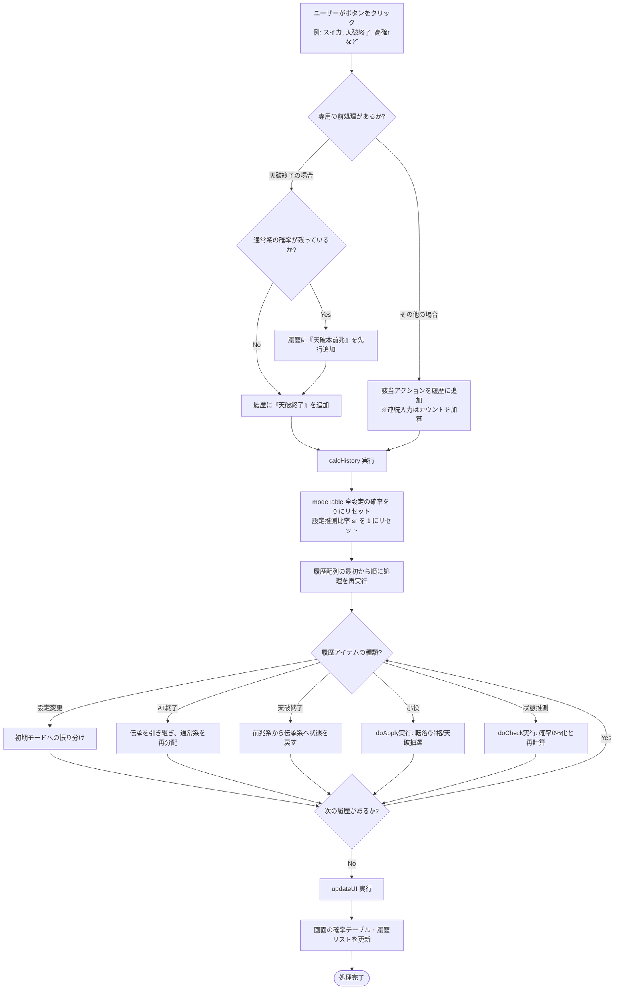
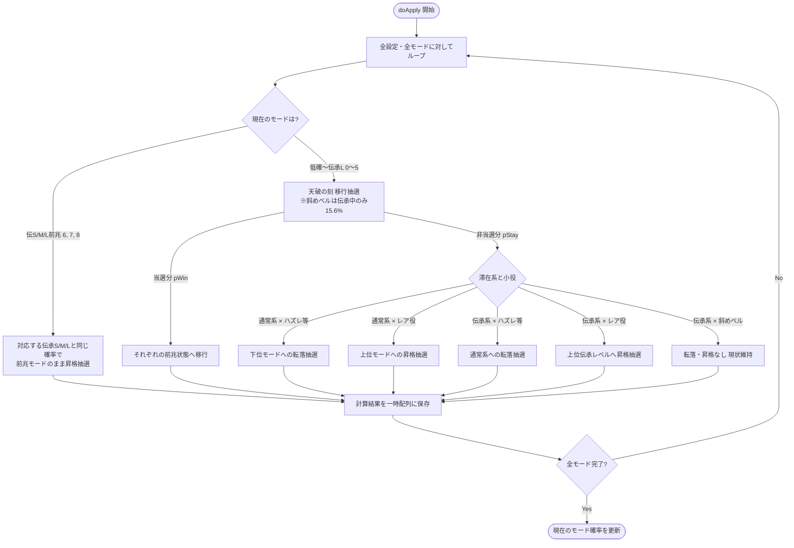
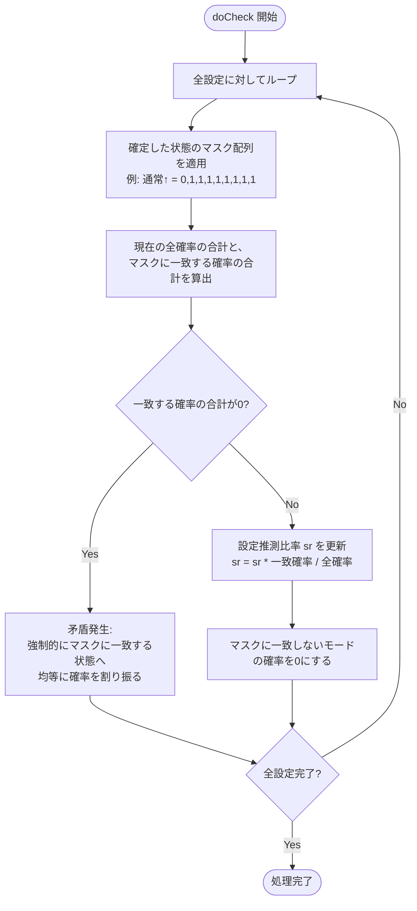

# Tensei2 状態推測シミュレーター 仕様書

## 1. 概要
パチスロ（北斗の拳 転生の章などをベースにした独自仕様）のモード移行および滞在状態の推測を行うためのウェブアプリケーションです。ユーザーが小役やイベントの履歴を入力することで、各設定（設定1〜6）ごとの現在の滞在モード確率をリアルタイムに計算・表示します。

## 2. モード構成（全9モード）
内部状態は以下の9つのモードで管理されます。

1. **通常系 (3種)**
   - `低確` (0)
   - `通常` (1)
   - `高確` (2)
2. **伝承系 (3種)**
   - `伝承S` (3)
   - `伝承M` (4)
   - `伝承L` (5)
3. **前兆系 (3種)**
   - `伝S前兆` (6)
   - `伝M前兆` (7)
   - `伝L前兆` (8)

※ 以前存在していた「通常前兆」は廃止され、通常系からの当選は直接「伝承S/M/L前兆」のいずれかへ振り分けられる仕様となっています。

## 3. アクション（履歴入力）の仕様

### 小役
*   **弱チェ / スイカ / チャンス勝舞揃い / 強チェ**
    *   状態の昇格抽選、および天破の刻（前兆）への移行（当選）抽選を行います。
    *   伝承モード・伝承前兆モード滞在時も、それぞれ対応する確率で伝承レベルの昇格抽選が行われます。
*   **ハズレ / リプレイ**
    *   通常系：下位モードへの転落抽選を行います。
    *   伝承系：伝承モードからの転落抽選（通常系への移行）を行います。
*   **斜めベル**
    *   通常系：ハズレ・リプレイと同様の転落抽選を行います。
    *   伝承系：転落抽選は行わず、一律15.6%で天破の刻への移行抽選のみを行います。

### 状態確認（絞り込み）
現在の演出等から滞在状態が濃厚になった場合に使用し、あり得ない状態の確率を0%にして再計算します。
*   **低確↓ / 通常↓ / 高確↓**: 指定された状態以下であることを確定させます。
*   **通常↑ / 高確↑**: 指定された状態以上であることを確定させます。
*   **天破本前兆**: 状態が前兆系（伝S/M/L前兆）のいずれかであることを確定させます。

### イベント
*   **設定変更**
    *   全履歴をリセットし、朝一の初期モード（低確/通常/高確/伝承S）へ各設定固有の確率で振り分けます。
*   **AT終了**
    *   **通常系からの当選時**: AT終了後のデフォルト振り分け（通常 約39.95%、高確 約58.45%、伝承S 1.6%）に再分配されます。
    *   **伝承系（伝承S/M/L）からの当選時**: AT終了後も100%その伝承モードを引き継ぎます。
    *   **前兆系からの当選時**: 滞在していた前兆（S/M/L）に対応する伝承モード（S/M/L）へ状態を引き継ぎます。
    *   *※ すべての確率が0%の状態で押下した場合は、100%通常系で当選したものとしてデフォルトの振り分けを適用します。*
*   **天破終了**
    *   前兆系の状態から、それぞれ対応する伝承系の状態へと戻します（伝S前兆 → 伝承Sなど）。
    *   *※ 通常系の確率が残っている状態で押下された場合、自動的に履歴へ「天破本前兆」を挿入した上で終了処理を実行します。*

## 4. UI / UXの仕様

*   **確率テーブルの表示**
    *   設定1〜設定6ごとに、現在の滞在確率をパーセンテージで一覧表示します。
    *   表示順は `低確 → 通常 → 高確 → 前兆(S/M/L) → 伝承(S/M/L)` となっています。
*   **合算・詳細のトグル機能**
    *   「前兆」および「伝承」の行は、デフォルトではS/M/Lを合算した確率が表示されます。
    *   行をタップ（クリック）することで、独立してS/M/Lの詳細行を展開・折りたたみすることが可能です。
    *   直感的に操作可能にするため、折りたたみ時は行の先頭に `▶`、展開時は `▼` アイコンが表示されます。
    *   テーブルの列幅は固定（`table-layout: fixed`）されており、トグル操作によってレイアウトが崩れないよう配慮されています。

## 5. アクション実行フローチャート

アクション（小役の入力、状態の確認、イベントの発生など）を実行した際に、内部でどのような順序で処理・再計算が行われているかを示すフローチャートです。

### 5.1. 全体フロー

### 5.2. 小役処理（doApply）の詳細フロー

### 5.3. 状態絞り込み処理（doCheck）の詳細フロー

